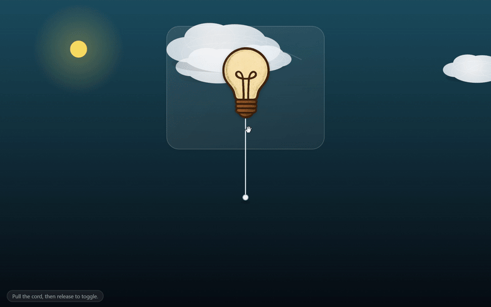

# GlowPull || 💡
Interactive pull-cord light bulb animation

  

This is a simple web application built with HTML, CSS, and JavaScript that simulates a pull-cord light bulb. Pull the cord below the bulb, and watch the bulb switch between on and off states with a smooth animation.

---

## 🚀 Features

- Cartoon-style light bulb images (on and off)
- Realistic cord physics animation
- Interactive and responsive design
- Day and Night background for visual effect

---

## 💡 Website

 - <a href="https://fatmassm.github.io/GlowPull/" target="_blank" rel="noopener noreferrer">
     GlowPull ✨
  </a>
  
---

## 🚩 How It Works

1. The page displays a light bulb and a cord hanging below it.
2. When the user clicks and drags (or pulls) the cord, a JavaScript function detects the pull.
3. The bulb switches from the off state to the on state, and vice versa.
4. CSS animations and transitions create a smooth visual effect.

---

## ✔️ Technologies Used

- HTML5
- CSS3
- JavaScript (Vanilla JS)
- PNG images for bulb states

---

## 📬 Contact

Fatma Susam 

---

